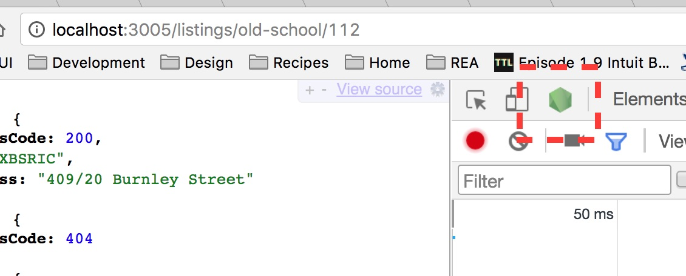

# medhi-api-test
https://git.realestate.com.au/mehdi-mollaverdi/free-monad-exercises

### Getting started

`nvm install` to install node version in `.nvmrc`

`yarn install`

`yarn start`

Then visit [http://localhost:3005/listings/old-school/112](http://localhost:3005/listings/old-school/112)

### Debugging

This app uses the `--inspect` flag for running the server. So you can debug the server code in Chrome the same way you would with client code, by clicking on the green button

